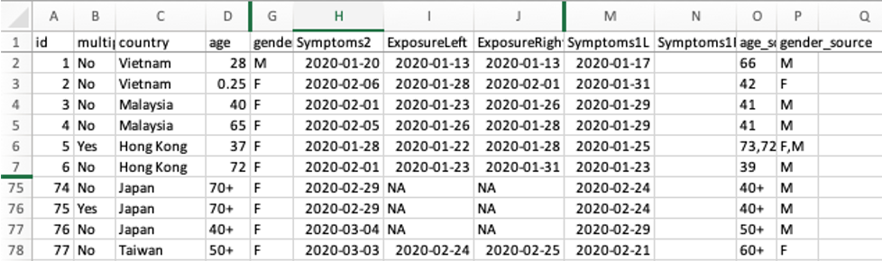
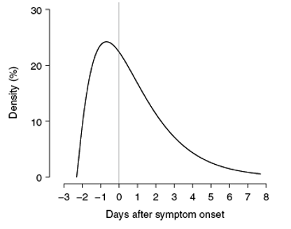
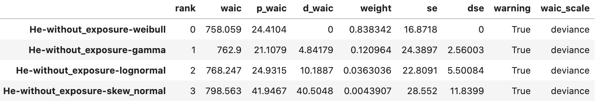
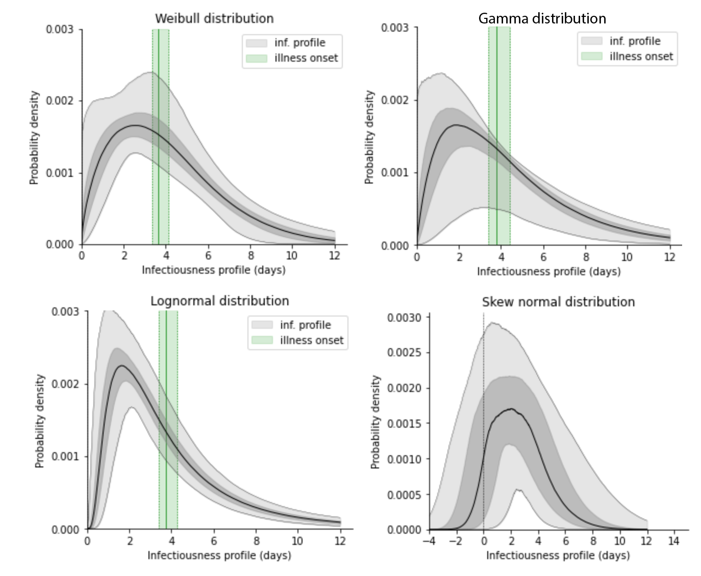
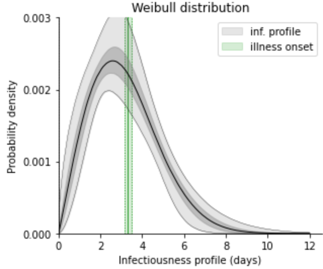

# Replication of the results of He et al NatMed 2020

*Andrei R. Akhmetzhanov*

This repository is to infer infectiousness profile using distribution of serial intervals and to replicate the results of He et al NatMed 2020.

**Dataset of He et al.** compromises 77 infector-infectee pairs

  

## He et al study

[He et al.](http://dx.doi.org/10.1038/s41591-020-0869-5) obtained point-wise estimates of the infectiousness profile using maximum likelihood estimation (MLE).

  

The infectiousness profile was fitted to the shifted gamma distribution with the shift –2.3 days (95% CI: –3.0, –0.8), the maximum of the distribution (=the mode) was at –0.7 days (95% CI: –2.0, 0.2). The estimated fraction of presymptomatic transmissions was 44% (95% CI: 25%, 69%).

## Replication in Stan

We performed our simulations in Stan. Comparing four distributions by WAIC values, we identified the best-fit distribution as a shifted Weibull distribution:

  

where all fits looked as follows:

  

The best-fit Weibull distribution was shifted by –3.7 days (95% CI: –4.3, –3.3) with the mode at –0.8 days (95% CI: –2.5, 0.5). The presymptomatic transmission compromised 47% (95% CI: 34%, 61%). **These estimates are almost exactly the same as the ones obtained by He et al.**

We did another double-check by extending the dataset using by He et al. After including additional infector-infectee pairs collected by us and not shown here (literature search + Japanese data resulted in total 265 pairs), we arrived at quite similar results with only difference that the Weibull distribution became more determined:

  

In this case the shift was –3.2 days (95% CI: –3.5, –3.2), the mode was at –0.8 days (95% CI: –1.4, –0.2). The fraction of presymptomatic transmissions was a bit higher than before: 58% (95% CI: 49%, 67%).

# Code scripts

* [A1. Stan simulations.ipynb](https://nbviewer.jupyter.org/github/aakhmetz/COVID19-Replication-He-et-al-2020/blob/master/scripts/Andrei/A.%20He%20et%20al%20Nat%20Med%20replication%20%5BR%5D.ipynb?flush_cache=false) Code to run MCMC simulations in cmdStan

* [A2. Processing the traces.ipynb](https://nbviewer.jupyter.org/github/aakhmetz/COVID19-Replication-He-et-al-2020/blob/master/scripts/Andrei/A2.%20He%20et%20al%20Nat%20Med%20Processing%20traces.ipynb?flush_cache=false) Python script to analyse posterior distirubions generated by Stan

## About incubation period distribution

The incubation period period used in He et al was a lognormal distribution of the mean 5.2 days (95% CI: 4.1, 7.0) from [Li et al 2020](http://dx.doi.org/10.1056/NEJMoa2001316). In this case, the parameters of the lognormal distribution are 1.434 and 0.661.

In our Stan simulations we used the estimates of [Linton et al 2020](http://dx.doi.org/10.3390/jcm9020538) which were based on a larger dataset. In that case the mean is 5.1 days and parameters of the lognormal distribution are 1.519 and 0.615. [Linton et al](http://dx.doi.org/10.3390/jcm9020538) estimates were consistent to two other studies of [Baker et al 2020](http://dx.doi.org/10.2807/1560-7917.ES.2020.25.5.2000062) and [Lauer et al 2020](http://dx.doi.org/10.7326/M20-0504).

# Conclusions

The results of simulations in Stan show high consistency with the MLE estimates obtained in [He et al 2020](http://dx.doi.org/10.1038/s41591-020-0869-5). Unintentional exclusion of two extreme datapoints in simulations of He et al did not affect the resulting estimates. In our simulations we did account for those two missing points.

Fitting data with different distributions showed that shifted distributions with positive support (Weibull/gamma/lognormal) were much better than skewed normal distribution in terms of WAIC values.

Accounting for more data points (extended dataset available for Japan and not included here) showed even a better robustness of He et al results.

Our replication exercise does not support the claims of a recent preprint of [Ashcroft et al](https://arxiv.org/abs/2007.06602), who argued that the infectiousness profile would be similar to a skewed normal distribution (~the gamma distribution with a fairly large shift) and the results of [He et al](http://dx.doi.org/10.1038/s41591-020-0869-5) are incorrect. We consider the omission of two data points by He et al as a minor technical issue rather than an error. Our replication demonstrate consistency with He et al after inclusion of two points.

## References

Ashcroft, P.; Huisman, J. S.; Lehtinen, S.; Bouman, J. A.; Althaus, C. L.; Regoes, R. R.; Bonhoeffer, S. COVID-19 infectivity profile correction. arXiv 2020 ([https://arxiv.org/abs/2007.06602](https://arxiv.org/abs/2007.06602))

Backer, J.A.; Klinkenberg, D.; Wallinga, J. Incubation period of 2019 novel coronavirus (2019-nCoV) infections among travellers from Wuhan, China, 20–28 January 2020. Euro Surveill. 2020. ([doi:10.2807/1560-7917.ES.2020.25.5.2000062](http://dx.doi.org/10.2807/1560-7917.ES.2020.25.5.2000062))

He, X.; Lau, E.H.Y.; Wu, P.; et al. Temporal dynamics in viral shedding and transmissibility of COVID-19. Nat Med 2020 ([doi:10.1038/s41591-020-0869-5](http://dx.doi.org/10.1038/s41591-020-0869-5))

Lauer, S.A.; Grantz, K.H.; Bi, Q.; Jones, F.K.; Zheng, Q.; Meredith, H. R.; Azman, A.S.; Reich, N.G.; Lessler, J. The Incubation Period of Coronavirus Disease 2019 (COVID-19) From Publicly Reported Confirmed Cases: Estimation and Application. Annals of Internal Medicine 2020 ([doi:10.7326/M20-0504](http://dx.doi.org/10.7326/M20-0504))

Li, Q.; et al. Early transmission dynamics in Wuhan, China, of novel coronavirus-infected pneumonia. N. Engl. J. Med. 2020 ([doi:10.1056/NEJMoa2001316](http://dx.doi.org/10.1056/NEJMoa2001316))

Linton, N.M.; Kobayashi, T.; Yang, Y.; Hayashi, K.; Akhmetzhanov, A.R.; Jung, S-m.; Yuan, B.; Kinoshita, R.; Nishiura, H. Incubation period and other epidemiological characteristics of 2019 novel coronavirus Infections with right truncation: A statistical analysis of publicly available case data. Journal of Clinical Medicine 2020, 9(2), 538 ([doi:10.3390/jcm9020538](http://dx.doi.org/10.3390/jcm9020538))

---------
**Thank you for your interest!**

Few words of caution: We would like to note that our code is not supposed to work out of box, because the links used in the notebooks were user-specific, and our main intention was to show the relevance of our methods.
